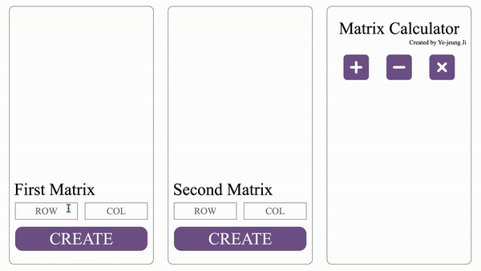

## 제목: 행렬 계산기 

 

### 제작자: 지예증, 김은영

 

### 목표: 👨🏻‍💻

- MVC Model을 기반으로 코드를 작성한다.
- ES6를 기반으로 코드를 작성한다.(module, arrow function, class...)
- 반복문과 배열 고차함수 활용을 목표로 한다.
- git과 github 사용을 목표로 한다.
- 함수는 가능하면, 한 가지의 일만 하도록 설계한다.(15줄을 넘기지 않는다.)
- HTML은 PUG를 통하여, CSS는 SASS를 통하여 만든다.

### 완성화면: 👍🏻

 

 

### 후기: 🙆🏻‍♂️

- module과 class를 사용하면서, 어떻게 하면 코드의 중복을 줄이고, 재사용 율을 높일 수 있는지 고민하게 되었고, 클린 코딩을 어떻게 하면 될지 감을 잡게 되었다.
- MVC Model을 지키기 위해서 상당한 시간을 고민하면서, 각자의 역할에 맞게 분류하는 것이 협업할 때에 유리하다는 것을 알게되었다.

 

### 보완할점: 🛠
